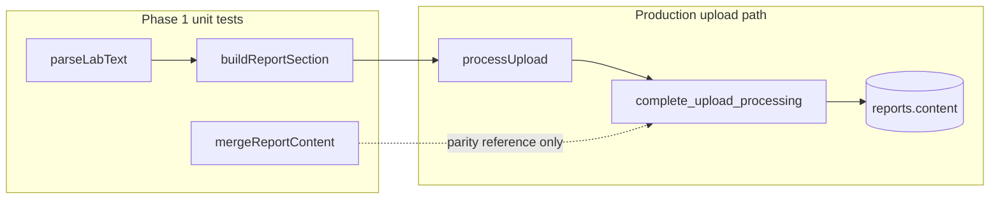

# Research: Critical-path pure logic — parser and merge functions for Phase 1 Vitest rollout

**Date**: 2026-06-05T22:55:11+02:00  
**Researcher**: Cursor Agent  
**Git Commit**: `5a1fceb7ef0d2c8ebfca768c1aa0c2eee39defaf`  
**Branch**: main  
**Repository**: [msp92/TakeCare](https://github.com/msp92/TakeCare)

## Research Question

What pure-logic code on the TakeCare critical path (PDF upload → lab text parse → Markdown report merge) should Phase 1 unit tests cover, where does it live, what fixtures exist, and what is required to bootstrap Vitest?

Grounded in `context/foundation/test-plan.md` Phase 1 (risks #2 and #7).

## Summary

TakeCare has **no automated test runner** today. The highest-value Phase 1 targets are two small, I/O-free modules:

1. **`parseLabText`** in [`src/lib/services/parser.ts`](https://github.com/msp92/TakeCare/blob/5a1fceb7ef0d2c8ebfca768c1aa0c2eee39defaf/src/lib/services/parser.ts) — Diagnostyka lab text → `LabItem[]` (risk #2: wrong values, units, dates).
2. **`mergeReportContent`** / **`buildReportSection`** in [`src/lib/services/reports.ts`](https://github.com/msp92/TakeCare/blob/5a1fceb7ef0d2c8ebfca768c1aa0c2eee39defaf/src/lib/services/reports.ts) — Markdown section formatting and append semantics (risk #7: duplicate/missing sections when multiple uploads).

Production uploads use **TS section formatting + SQL append** via `complete_upload_processing` RPC; `mergeReportContent` is kept as the pure TS reference for parity tests.

Two **owner-derived OCR text fixtures** with hand-authored golden oracles exist under `scripts/fixtures/`. The current parser **matches 0/N items** on either fixture (values partially correct; unit/ref splitting and OCR noise filtering are the main gaps). Vitest tests against these oracles will fail until `parseLabText` is improved — this is expected TDD signal, not bad fixtures.

Vitest can run parser/merge tests in plain Node (no Workers/Miniflare) because these modules have no `astro:env` imports. CI wiring is explicitly deferred to test-plan Phase 4.

## Detailed Findings

### Parser pure logic (`parseLabText`)

**Module**: [`src/lib/services/parser.ts`](https://github.com/msp92/TakeCare/blob/5a1fceb7ef0d2c8ebfca768c1aa0c2eee39defaf/src/lib/services/parser.ts)

| Symbol | Lines | Role |
|--------|-------|------|
| `DATE_PATTERNS` | 3–7 | Date extraction priority: labeled date → first `DD.MM.YYYY` → ISO |
| `LAB_ROW` | 10–11 | Diagnostyka row regex: name + numeric value + trailing unit/ref |
| `normalizeDate` | 15–26 | `DD.MM.YYYY` → `YYYY-MM-DD`; ISO passthrough |
| `extractReportDate` | 28–36 | Scans patterns; **falls back to today's UTC date** if none match |
| `parseTrailingUnitAndRef` | 38–70 | Parses unit and reference range from trailing tokens |
| **`parseLabText`** | 75–112 | **Public entry point** — line loop, dedup by `name:value`, attaches shared report date |

**Output type** — [`src/types.ts`](https://github.com/msp92/TakeCare/blob/5a1fceb7ef0d2c8ebfca768c1aa0c2eee39defaf/src/types.ts) `LabItem`: `name`, `value`, optional `unit`/`refRange`, `date`.

**Purity**: No Astro, Supabase, or file I/O. Only impurity is **`new Date()`** in `extractReportDate` (line 35) when no date pattern matches — tests must either mock the clock or treat fallback as an explicit contract.

**Production call site**: [`src/lib/services/uploads.ts`](https://github.com/msp92/TakeCare/blob/5a1fceb7ef0d2c8ebfca768c1aa0c2eee39defaf/src/lib/services/uploads.ts) line 57 inside `processUpload` (surrounded by Supabase/storage I/O).

**Out of Phase 1 scope**: PDF extraction (`src/components/upload/PdfExtractor.ts`), OCR (`tesseract.js`), and `unpdf` — capture extracted text as fixtures instead of unit-testing extraction libraries.

#### Date extraction contract (risk #2 hotspot)

Priority in `DATE_PATTERNS`:

1. `data wykonania:` or `data badania:` + `DD.MM.YYYY` (case-insensitive)
2. First `DD.MM.YYYY` / `DD-MM-YYYY` / `DD/MM/YYYY` anywhere in text
3. First `YYYY-MM-DD` anywhere in text
4. Fallback: `new Date().toISOString().slice(0, 10)` (UTC today)

**Edge-case risk**: Pattern 2 matches the **first** date in full text — an unrelated earlier date could win over the labeled report date if the label is missing.

**Secondary today fallback**: [`buildReportSection`](https://github.com/msp92/TakeCare/blob/5a1fceb7ef0d2c8ebfca768c1aa0c2eee39defaf/src/lib/services/reports.ts#L19) uses `new Date()` when items lack `date` (defensive; parser always sets `date` today).

#### Parsing behaviors to assert

- Comma decimals → dot in `value` (line 92)
- Ref ranges: `12,0-16,0`, `<190`, `≤` variants via `parseTrailingUnitAndRef`
- Dedup: same `name:value` skipped (lines 96–100) — **bug for same-name-different-unit rows** (e.g. NRBC `0.00` as `tys/ul` vs `%` are distinct parameters, not duplicates)
- Short lines (`< 4` chars) skipped (lines 82–84)
- Empty/unparseable text → `[]`

### Report merge pure logic (`mergeReportContent`)

**Module**: [`src/lib/services/reports.ts`](https://github.com/msp92/TakeCare/blob/5a1fceb7ef0d2c8ebfca768c1aa0c2eee39defaf/src/lib/services/reports.ts)

| Function | Lines | Pure? | Role |
|----------|-------|-------|------|
| `formatMarkdownSection` | 5–11 | Yes | `## date` + Markdown table |
| `buildReportSection` | 14–21 | Yes* | One upload's section; empty items → `""` |
| **`mergeReportContent`** | 24–32 | Yes | Trims current, appends section with `\n\n` |
| `buildReport` | 38–50 | No | SELECT + merge; verification/tests only |

**Production path** ([`uploads.ts`](https://github.com/msp92/TakeCare/blob/5a1fceb7ef0d2c8ebfca768c1aa0c2eee39defaf/src/lib/services/uploads.ts) ~70–75):

1. `buildReportSection(items)` in TS
2. Pass section to `complete_upload_processing` RPC
3. SQL appends to `reports.content`

**Does not call** `mergeReportContent` in production.

### SQL append (parity reference for risk #7)

**Migration**: [`supabase/migrations/20260602120000_complete_upload_processing_rpc.sql`](https://github.com/msp92/TakeCare/blob/5a1fceb7ef0d2c8ebfca768c1aa0c2eee39defaf/supabase/migrations/20260602120000_complete_upload_processing_rpc.sql)

Append logic (lines 43–46):

```sql
content = case
  when trim(public.reports.content) = '' then excluded.content
  else public.reports.content || E'\n\n' || excluded.content
end
```

| Concern | TS (`mergeReportContent`) | SQL (production) |
|---------|---------------------------|------------------|
| Section format | `buildReportSection` | Receives pre-built `p_report_section` from TS |
| Separator | `\n\n` | `E'\n\n'` |
| Empty existing | `currentContent.trim()` then branch | `trim(content) = ''` check only |
| Empty new section | Returns unchanged | Raises exception (lines 22–24) |

**Subtle parity gap**: TS trims `currentContent` before append; SQL appends to **untrimmed** stored content. Trailing whitespace on stored content could diverge — worth one explicit parity test case.

Phase 1 can model SQL append as a small pure helper in tests (mirror the `CASE`/`||` logic) without spinning up Supabase Docker (that's Phase 3).

### Fixtures and oracles

**Updated 2026-06-06** — owner supplied real OCR text + golden JSON oracles.

**Layout** ([`scripts/fixtures/`](scripts/fixtures/)):

| Input | Oracle | Provider | Items in oracle |
|-------|--------|----------|-----------------|
| `diagnostyka-ocr.txt` | `diagnostyka-ocr.expected.json` | Diagnostyka (OCR from `diagnostyka-sample.pdf`) | 28 |
| `alab-ocr.txt` | `alab-ocr.expected.json` | ALAB (OCR from `alab-sample.pdf`) | 5 |

**Removed**: `alab-clean.txt` (replaced by `alab-ocr.txt`).

**Oracle schema** (extends bare `LabItem[]`):

```json
{
  "dates": {
    "dataWykonaniaBadania": "YYYY-MM-DD",
    "dataPobrania": "...",
    "dataRejestracji": "...",
    ...
  },
  "items": [ { "name", "value", "unit", "refRange", "date" } ]
}
```

The `dates` block captures multiple report timestamps from the OCR header/footer. **`parseLabText` today only sets per-item `date`** (single extracted report date) — it does not return the `dates` object. Phase 1 tests should assert **`items` only** unless the plan extends the parser API.

**Manual verification**: [`scripts/verify-parser.ts`](scripts/verify-parser.ts) loads both `*-ocr.txt` files and prints JSON (no assertions). Updated to use `alab-ocr.txt`.

**Not committed**: PDFs (`scripts/fixtures/*.pdf`, `scripts/output/` gitignored).

**Still missing for Phase 1**:

- Edge fixtures: no-date text, garbled text → `[]`
- Merge golden: N sequential merges → N `##` sections
- `verify-parser.ts` oracle comparison (optional dev helper; Vitest is the real gate)

**Broken tooling**: `npm run debug:pdf` still references missing `scripts/debug-pdf-parse.ts`.

### Test infrastructure gap

| Area | Current state |
|------|---------------|
| Test runner | **None** — no vitest/jest/playwright in `package.json` devDependencies |
| Test scripts | `verify:parser` only (manual `tsx`) |
| Test files | 0 × `*.test.ts` / `*.spec.ts` |
| CI ([`.github/workflows/ci.yml`](https://github.com/msp92/TakeCare/blob/5a1fceb7ef0d2c8ebfca768c1aa0c2eee39defaf/.github/workflows/ci.yml)) | `npm ci` → `astro sync` → lint → build; **no test step** |
| Path alias | `@/*` → `./src/*` in `tsconfig.json` — Vitest config must mirror |

**Workers/Astro constraints for Phase 1**: **None blocking**. `parser.ts` and `reports.ts` import only types and plain TS. Workers/Miniflare (`@cloudflare/vitest-pool-workers`) needed only from Phase 2 (API integration). `astro:env/server` mocking deferred until handler tests.

**Phase 1 bootstrap checklist**:

1. Add `vitest` devDependency (align with Vite 7 override)
2. Add `vitest.config.ts`: `environment: "node"`, `@` alias, `test.include` pattern
3. Add `"test": "vitest run"` (+ optional `"test:watch"`) to `package.json`
4. Parser fixture-oracle tests loading `scripts/fixtures/*.txt` + `*.expected.json`
5. Merge parity tests: empty → first section; N merges → N sections, order, no dupes; SQL-append helper parity
6. Optional: mock `Date` for no-date fallback tests
7. Update `scripts/fixtures/README.md` with oracle workflow (out of scope unless plan includes it)

**Explicitly deferred** (per test-plan): CI gate (Phase 4), Supabase Docker RLS (Phase 3), API integration (Phase 2), Playwright e2e.

## Code References

- [`src/lib/services/parser.ts:75-112`](https://github.com/msp92/TakeCare/blob/5a1fceb7ef0d2c8ebfca768c1aa0c2eee39defaf/src/lib/services/parser.ts#L75-L112) — `parseLabText` entry point
- [`src/lib/services/parser.ts:28-36`](https://github.com/msp92/TakeCare/blob/5a1fceb7ef0d2c8ebfca768c1aa0c2eee39defaf/src/lib/services/parser.ts#L28-L36) — date extraction + today fallback
- [`src/lib/services/parser.ts:38-70`](https://github.com/msp92/TakeCare/blob/5a1fceb7ef0d2c8ebfca768c1aa0c2eee39defaf/src/lib/services/parser.ts#L38-L70) — unit/ref parsing
- [`src/lib/services/reports.ts:14-32`](https://github.com/msp92/TakeCare/blob/5a1fceb7ef0d2c8ebfca768c1aa0c2eee39defaf/src/lib/services/reports.ts#L14-L32) — section build + merge
- [`src/lib/services/uploads.ts:57`](https://github.com/msp92/TakeCare/blob/5a1fceb7ef0d2c8ebfca768c1aa0c2eee39defaf/src/lib/services/uploads.ts#L57) — production parser call
- [`supabase/migrations/20260602120000_complete_upload_processing_rpc.sql:43-46`](https://github.com/msp92/TakeCare/blob/5a1fceb7ef0d2c8ebfca768c1aa0c2eee39defaf/supabase/migrations/20260602120000_complete_upload_processing_rpc.sql#L43-L46) — SQL append semantics
- [`scripts/verify-parser.ts:17-20`](https://github.com/msp92/TakeCare/blob/5a1fceb7ef0d2c8ebfca768c1aa0c2eee39defaf/scripts/verify-parser.ts#L17-L20) — manual fixture loader (precursor to tests)
- [`scripts/fixtures/diagnostyka-ocr.txt`](https://github.com/msp92/TakeCare/blob/5a1fceb7ef0d2c8ebfca768c1aa0c2eee39defaf/scripts/fixtures/diagnostyka-ocr.txt) — primary Diagnostyka fixture
- [`context/foundation/test-plan.md`](https://github.com/msp92/TakeCare/blob/5a1fceb7ef0d2c8ebfca768c1aa0c2eee39defaf/context/foundation/test-plan.md) — Phase 1 scope, risks #2/#7, fixture-oracle guidance

## Architecture Insights



- **Separation of concerns**: Parsing and Markdown formatting are pure TS; persistence and atomic merge are SQL RPC. Phase 1 tests the TS contracts; SQL parity is modeled in tests without Docker.
- **Fixture-oracle pattern**: Input text committed; expected `LabItem[]` authored from requirements. Anti-pattern: snapshotting `verify-parser.ts` stdout.
- **Cost × signal** (test-plan §1): Unit tests on `parseLabText` + merge parity are the cheapest layer for risks #2 and #7 before integration/e2e.

## Historical Context (from prior changes)

- [`context/archive/2026-05-28-first-pdf-to-report/plan.md`](https://github.com/msp92/TakeCare/blob/5a1fceb7ef0d2c8ebfca768c1aa0c2eee39defaf/context/archive/2026-05-28-first-pdf-to-report/plan.md) — Phase 3 planned `scripts/fixtures/` with Diagnostyka OCR + clean-text sample; manual verification only at ship time.
- [`context/archive/2026-05-28-first-pdf-to-report/reviews/impl-review.md`](https://github.com/msp92/TakeCare/blob/5a1fceb7ef0d2c8ebfca768c1aa0c2eee39defaf/context/archive/2026-05-28-first-pdf-to-report/reviews/impl-review.md) — F3: production merge moved to RPC; `mergeReportContent` exported for pure/test use; `debug-pdf-parse.ts` removed.
- [`context/archive/2026-05-28-first-pdf-to-report/research.md`](https://github.com/msp92/TakeCare/blob/5a1fceb7ef0d2c8ebfca768c1aa0c2eee39defaf/context/archive/2026-05-28-first-pdf-to-report/research.md) — Owner PDFs for spike not in repo; Diagnostyka Tier-1 text garbled, OCR path required.
- [`context/foundation/test-plan.md`](https://github.com/msp92/TakeCare/blob/5a1fceb7ef0d2c8ebfca768c1aa0c2eee39defaf/context/foundation/test-plan.md) — Phase 1 opened as this change; cookbook §6.1 TBD until Phase 1 ships.

## Related Research

- [`context/archive/2026-05-28-first-pdf-to-report/research.md`](https://github.com/msp92/TakeCare/blob/5a1fceb7ef0d2c8ebfca768c1aa0c2eee39defaf/context/archive/2026-05-28-first-pdf-to-report/research.md) — PDF extraction spike, parser layout risk, fixture strategy origin

## Open Questions

1. **Date fallback contract**: Is "today's UTC date when no pattern matches" intentional product behavior, or should parser return empty/`null` date and let the upload fail validation?
2. **`dates` metadata in oracles**: Should Phase 1 tests assert the full `dates` object (requires parser API extension), or **`items` only** with item-level `date`?
3. **Parser improvement scope**: Oracles imply significant parser work (MIN/MAX column split, OCR noise filtering, ALAB layout). Is Phase 1 **tests + parser fixes** in one change, or tests-only with known failures?
4. **OCR misreads in fixture text**: e.g. `Monocyty 93` (oracle expects `9.3`), `PDW 111` (oracle expects `11.1`). Fix parser heuristics, or correct fixture text to match true lab values?
5. **`debug:pdf` script**: Remove broken npm script vs restore minimal CLI writing to gitignored `scripts/output/`?
6. **SQL parity depth**: Phase 1 — pure TS helper mirroring SQL append only, or pgTAP in a later phase?

## Follow-up Research 2026-06-06T01:18:48+02:00

**Trigger**: Owner updated `*-ocr.txt` fixtures and added `*.expected.json` golden oracles in `scripts/fixtures/`.

### What changed

| Before | After |
|--------|-------|
| Synthetic 13-line Diagnostyka sample | Real 66-line OCR export (morfologia, 2 pages) |
| `alab-clean.txt` (5 lines, synthetic) | `alab-ocr.txt` (37 lines, real ALAB OCR) |
| No golden files | `diagnostyka-ocr.expected.json` (28 items + dates), `alab-ocr.expected.json` (5 items + dates) |
| `scripts/fixtures/README.md` | Updated with oracle pairing and PDF capture workflow |

### Parser vs oracle (current `parseLabText`)

Ran `npm run verify:parser` and compared output to expected JSON:

| Fixture | Oracle items | Parser items | Full `LabItem` matches |
|---------|--------------|--------------|------------------------|
| `diagnostyka-ocr` | 28 | 31 | **0 / 28** |
| `alab-ocr` | 5 | 7 | **0 / 5** |

**Date extraction works** for both fixtures: all items get `2025-04-03` (Diagnostyka) and `2026-05-22` (ALAB), matching oracle item dates. Diagnostyka labeled date `Data wykonania :03.04.2025` on line 14 is picked up correctly.

### Gap taxonomy (in priority order for plan)

#### 1. Unit / reference range splitting (systematic — both providers)

Diagnostyka OCR rows use **`Jedn. MIN MAX`** columns with a trailing `*`:

```
Leukocyty 6,21 tys/ul* 4,00 10,00
```

Oracle expects: `unit: "tys/ul"`, `refRange: "4,00-10,00"`.

Parser today leaves MIN/MAX inside `unit` and sets `refRange: undefined` for all rows.

ALAB rows use **em-dash ref ranges** after the unit:

```
Sód w surowicy (035) 141 mmol/L 136 — 145
```

Oracle expects: `unit: "mmol/L"`, `refRange: "136—145"`.

Same failure mode — ref range stays in `unit`.

#### 2. OCR noise false positives (Diagnostyka: 6 extra rows)

Parser matches header/footer prose as lab rows:

| Spurious row | Source line |
|--------------|-------------|
| `LUX MED SP. ZO.O. kod = 5` | Line 4 (address block) |
| `Szturmowa, = 02` | Line 5 |
| `Badanie wykonano metodą… Sysmex XN = 10.` | Line 58 |
| `temp. = 2` | Line 63 |

ALAB extras: `ALAB Laboratoria Sp. z = 0.0`, footer barcode paragraph.

**Plan implication**: need row filtering (section context, column header detection, or denylist patterns) — not just regex tightening.

#### 3. OCR misreads vs oracle (2 Diagnostyka mismatches)

| Test | Fixture text | Parser | Oracle | Notes |
|------|--------------|--------|--------|-------|
| Monocyty (%) | `Monocyty 93 %*` (line 24) | `93` | `9.3` | Likely OCR dropped decimal point |
| PDW | `PDW 111 fl*` (line 55) | `111` | `11.1` | Likely OCR merged decimal |

Parser cannot infer these without heuristics (decimal insertion) or fixture text correction.

#### 4. Same name, different unit — NRBC (dedup bug)

The oracle correctly lists two **distinct** NRBC parameters: `0.00` with unit `tys/ul` and `0.00` with unit `%`. These are not duplicates — the same analyte is reported in two unit systems on Diagnostyka morfologia reports.

The parser dedupes by `name:value` only (`parser.ts` lines 96–100). That key treats the second NRBC row as a duplicate of the first and drops it, so the `%` row never appears and the surviving row keeps the wrong unit/ref.

**Plan implication**: remove or fix dedup — identity must include **unit** (or equivalent), e.g. `(name, value, unit)`, so same-name rows with different units are both kept. Do not treat NRBC `tys/ul` and NRBC `%` as duplicates.

#### 5. Diagnostyka percent-row OCR artifacts

Rows like `Neutrofile 40.3 %'* 45,0 700 L` — OCR corrupted `70,0` → `700`. Oracle refRange `45,0-70,0` reflects corrected reading, not raw OCR tokens. Parser cannot reach oracle without normalization heuristics.

### ALAB-specific notes

- MVP is Diagnostyka-first, but owner supplied ALAB oracle — useful as **second layout** test (name includes `(code)`, em-dash refs).
- 5/5 expected lab names are found by name+value; failures are unit/ref only + 2 noise rows.
- OCR typo `mgldL` in fixture line 18; oracle correctly expects `mg/dL`.

### Recommended test harness shape

```typescript
// For each scripts/fixtures/<name>.txt:
const expected = JSON.parse(readFileSync(`<name>.expected.json`));
const actual = parseLabText(readFileSync(`<name>.txt`));
expect(actual).toEqual(expected.items); // strict deep equal
```

Optional separate `describe("dates metadata")` deferred until parser exports `dates`.

Vitest fixture loader pattern:

```
scripts/fixtures/
  diagnostyka-ocr.txt
  diagnostyka-ocr.expected.json
  alab-ocr.txt
  alab-ocr.expected.json
```

Pair by basename convention `<stem>.txt` + `<stem>.expected.json`.

### Implications for `/10x-plan`

Phase 1 is **not** Vitest bootstrap alone — oracles expose parser gaps that must be scheduled:

1. Bootstrap Vitest + fixture-oracle tests (will fail red)
2. Parser: split unit from MIN/MAX (Diagnostyka) and em-dash refs (ALAB)
3. Parser: filter non-lab rows (section-aware or heuristics)
4. Parser: fix dedup key — include unit so same-name rows (e.g. NRBC `tys/ul` vs `%`) are not dropped
5. Merge parity tests (unchanged from prior research)
6. Decide OCR misread policy (fix fixture text vs parser heuristics) for Monocyty/PDW

**Resolved from prior open questions**: owner fixtures ✓, golden oracles ✓, ALAB kept as secondary layout ✓.
